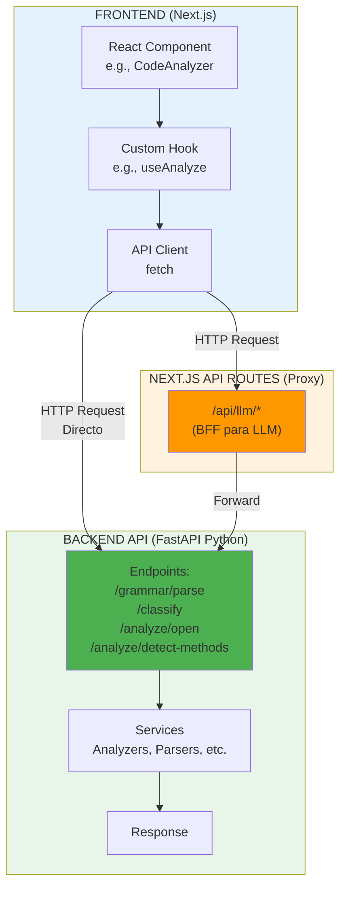
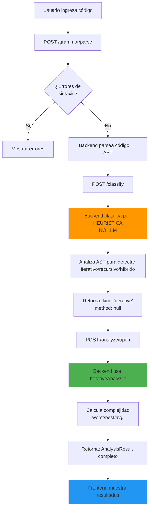
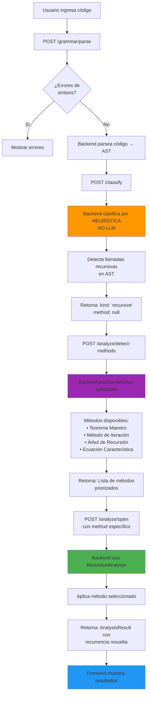
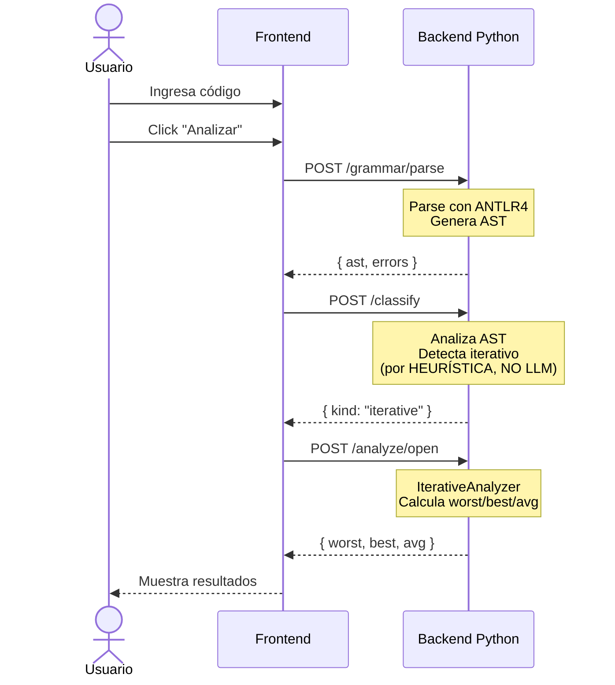
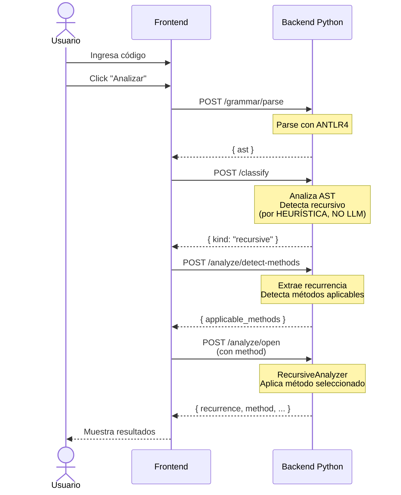

# Flujo de Peticiones Backend desde Frontend

## Descripción General

Este documento describe el flujo completo y preciso de peticiones desde los componentes React del frontend hasta el backend de la API, incluyendo los proxies de Next.js, el manejo de errores y los estados de carga.

## Arquitectura de Comunicación




## Flujo Completo de Análisis

### Análisis de Algoritmo Iterativo



### Análisis de Algoritmo Recursivo




## Endpoints Principales

### 1. `/grammar/parse`

**Propósito**: Parsear código y generar AST

**Backend**: FastAPI Python (`apps/api`)

**Flujo completo**:

#### Frontend Component

```typescript
// apps/web/src/components/ManualModeView.tsx

const handleAnalyze = async () => {
  setLoading(true);
  
  try {
    // 1. PARSEAR CÓDIGO
    const parseResponse = await fetch(`${API_BASE_URL}/grammar/parse`, {
      method: 'POST',
      headers: { 'Content-Type': 'application/json' },
      body: JSON.stringify({ source: code })
    });

    if (!parseResponse.ok) {
      throw new Error('Error al parsear código');
    }

    const { ast, errors } = await parseResponse.json();
    
    if (errors && errors.length > 0) {
      // Mostrar errores de sintaxis
      setParseErrors(errors);
      return;
    }

    // Continuar con clasificación...
  } catch (error) {
    setError(error.message);
  } finally {
    setLoading(false);
  }
};
```

#### Backend Endpoint

```python
# apps/api/app/modules/parsing/router.py

@router.post("/parse")
async def parse_source(request: ParseRequest):
    try:
        # Parsear con ANTLR4
        ast = parse_to_ast(request.source)
        
        return {
            "ok": True,
            "ast": ast,
            "errors": []
        }
    except ParseError as e:
        return {
            "ok": False,
            "errors": [{
                "message": str(e),
                "line": e.line,
                "column": e.column
            }]
        }
```

### 2. `/classify`

**Propósito**: Clasificar tipo de algoritmo (iterativo/recursivo/híbrido)

**Método**: **HEURÍSTICA** (análisis de AST, NO usa LLM)

**Backend**: FastAPI Python

**Flujo completo**:

#### Frontend Component

```typescript
// apps/web/src/components/ManualModeView.tsx

// 2. CLASIFICAR ALGORITMO (por heurística)
const classifyResponse = await fetch(`${API_BASE_URL}/classify`, {
  method: 'POST',
  headers: { 'Content-Type': 'application/json' },
  body: JSON.stringify({ 
    source: code,
    ast: ast  // AST del paso anterior
  })
});

const { kind, method } = await classifyResponse.json();
// kind: "iterative" | "recursive" | "hybrid"
// method: null (para iterativos) o método detectado (para recursivos)
```

#### Backend Endpoint

```python
# apps/api/app/modules/classification/router.py

@router.post("/classify")
async def classify_algorithm(request: ClassifyRequest):
    # Clasificación por HEURÍSTICA (NO LLM)
    ast = request.ast or parse_to_ast(request.source)
    
    # Analizar AST para detectar tipo
    kind = detect_algorithm_kind(ast)
    # - Busca llamadas recursivas
    # - Analiza estructura de bucles
    # - Detecta patrones conocidos
    
    return {
        "kind": kind,  # "iterative" | "recursive" | "hybrid"
        "method": None  # Se determina después con /detect-methods
    }
```

**Nota importante**: Este endpoint **NO usa LLM**. La clasificación es 100% determinista basada en análisis del AST.

### 3. `/analyze/detect-methods` (Solo para Recursivos)

**Propósito**: Detectar qué métodos de resolución son aplicables

**Backend**: FastAPI Python

**Flujo completo**:

#### Frontend Component

```typescript
// apps/web/src/components/ManualModeView.tsx

if (kind === 'recursive') {
  // 3. DETECTAR MÉTODOS APLICABLES
  const methodsResponse = await fetch(`${API_BASE_URL}/analyze/detect-methods`, {
    method: 'POST',
    headers: { 'Content-Type': 'application/json' },
    body: JSON.stringify({ 
      source: code,
      ast: ast
    })
  });

  const { applicable_methods } = await methodsResponse.json();
  // applicable_methods: [
  //   { method: "master", priority: 1, applicability: "high" },
  //   { method: "iteration", priority: 2, applicability: "medium" },
  //   ...
  // ]
  
  // Usar el método de mayor prioridad
  selectedMethod = applicable_methods[0].method;
}
```

#### Backend Endpoint

```python
# apps/api/app/modules/analysis/router.py

@router.post("/detect-methods")
async def detect_applicable_methods(request: DetectMethodsRequest):
    ast = request.ast or parse_to_ast(request.source)
    
    # Extraer recurrencia del AST
    recurrence = extract_recurrence(ast)
    
    # Detectar métodos aplicables
    methods = []
    
    # Verificar Teorema Maestro
    if is_master_theorem_applicable(recurrence):
        methods.append({
            "method": "master",
            "priority": 1,
            "applicability": "high"
        })
    
    # Verificar Ecuación Característica
    if is_characteristic_equation_applicable(recurrence):
        methods.append({
            "method": "characteristic_equation",
            "priority": 2,
            "applicability": "high"
        })
    
    # Método de Iteración siempre aplicable
    methods.append({
        "method": "iteration",
        "priority": 3,
        "applicability": "medium"
    })
    
    # Árbol de Recursión para múltiples llamadas
    if has_multiple_recursive_calls(recurrence):
        methods.append({
            "method": "recursion_tree",
            "priority": 4,
            "applicability": "medium"
        })
    
    return {
        "applicable_methods": sorted(methods, key=lambda m: m["priority"])
    }
```

### 4. `/analyze/open`

**Propósito**: Analizar complejidad del algoritmo

**Backend**: FastAPI Python

**Flujo completo**:

#### Frontend Component (Iterativo)

```typescript
// apps/web/src/components/ManualModeView.tsx

if (kind === 'iterative') {
  // 4. ANALIZAR (Iterativo)
  const analyzeResponse = await fetch(`${API_BASE_URL}/analyze/open`, {
    method: 'POST',
    headers: { 'Content-Type': 'application/json' },
    body: JSON.stringify({
      source: code,
      mode: 'worst'  // o 'best' o 'avg'
    })
  });

  const analysisResult = await analyzeResponse.json();
  // analysisResult contiene:
  // - worst: { T_open, T_polynomial, big_o, big_omega, big_theta }
  // - best: { ... }
  // - avg: { ... }
  // - byLine: [ { line, count, cost } ]
}
```

#### Frontend Component (Recursivo)

```typescript
// apps/web/src/components/ManualModeView.tsx

if (kind === 'recursive') {
  // 4. ANALIZAR (Recursivo con método específico)
  const analyzeResponse = await fetch(`${API_BASE_URL}/analyze/open`, {
    method: 'POST',
    headers: { 'Content-Type': 'application/json' },
    body: JSON.stringify({
      source: code,
      method: selectedMethod  // "master" | "iteration" | etc.
    })
  });

  const analysisResult = await analyzeResponse.json();
  // analysisResult contiene:
  // - recurrence: { type, form, a, b, f, n0 }
  // - method: "master" | "iteration" | etc.
  // - master/iteration/characteristic_equation/recursion_tree: { ... }
  // - big_theta: "Θ(n log n)"
}
```

#### Backend Endpoint

```python
# apps/api/app/modules/analysis/router.py

@router.post("/open")
async def analyze_algorithm(request: AnalyzeRequest):
    ast = parse_to_ast(request.source)
    kind = detect_algorithm_kind(ast)
    
    if kind == "iterative":
        # Usar IterativeAnalyzer
        analyzer = IterativeAnalyzer()
        result = analyzer.analyze(
            ast=ast,
            mode=request.mode  # worst/best/avg
        )
        
        return {
            "worst": result.worst,
            "best": result.best,
            "avg": result.avg,
            "byLine": result.by_line
        }
    
    elif kind == "recursive":
        # Usar RecursiveAnalyzer
        analyzer = RecursiveAnalyzer()
        result = analyzer.analyze(
            ast=ast,
            method=request.method  # master/iteration/etc.
        )
        
        return {
            "recurrence": result.recurrence,
            "method": result.method,
            result.method: result.method_details,  # master/iteration/etc.
            "big_theta": result.big_theta
        }
```

## Proxies de Next.js (Solo para LLM)

**Importante**: Next.js **NO hace proxy** para los endpoints principales del backend Python. Las llamadas van directamente a `http://localhost:8000` (o la URL configurada en `NEXT_PUBLIC_API_BASE_URL`).

Next.js **solo** actúa como BFF (Backend for Frontend) para los endpoints de LLM:

### Endpoints con Proxy (Next.js)

```
/api/llm/*  → Maneja llamadas a Gemini LLM
```

**Ubicación**: `apps/web/src/app/api/llm/`

**Razón**: Proteger la API key del servidor y agregar lógica de negocio del frontend.

### Endpoints sin Proxy (Directo a Backend)

```
/grammar/parse           → http://localhost:8000/grammar/parse
/classify                → http://localhost:8000/classify
/analyze/open            → http://localhost:8000/analyze/open
/analyze/detect-methods  → http://localhost:8000/analyze/detect-methods
```

**Configuración**:
```typescript
// apps/web/src/config.ts
const API_BASE_URL = process.env.NEXT_PUBLIC_API_BASE_URL || 'http://localhost:8000';
```

## Manejo de Errores

### Error Types

```typescript
// apps/web/src/types/errors.ts

export type APIErrorType =
  | 'parse_error'        // Error de sintaxis en el código
  | 'analysis_error'     // Error durante el análisis
  | 'network_error'      // Error de conexión
  | 'server_error';      // Error interno del servidor

export interface APIError {
  type: APIErrorType;
  message: string;
  details?: any;
  line?: number;         // Para errores de parseo
  column?: number;       // Para errores de parseo
}
```

### Error Handler

```typescript
// apps/web/src/components/ManualModeView.tsx

try {
  const response = await fetch(`${API_BASE_URL}/grammar/parse`, ...);
  
  if (!response.ok) {
    const errorData = await response.json();
    
    if (response.status === 400) {
      // Error de parseo
      setParseErrors(errorData.errors);
    } else if (response.status === 500) {
      // Error del servidor
      setError('Error interno del servidor');
    }
    return;
  }
  
  // Procesar respuesta exitosa
} catch (error) {
  // Error de red
  setError('Error de conexión con el servidor');
}
```

## Estados de Carga

### Loading States

```typescript
// apps/web/src/components/ManualModeView.tsx

const [loadingStates, setLoadingStates] = useState({
  parsing: false,
  classifying: false,
  detectingMethods: false,
  analyzing: false
});

const handleAnalyze = async () => {
  // 1. Parsear
  setLoadingStates(prev => ({ ...prev, parsing: true }));
  const ast = await parseCode();
  setLoadingStates(prev => ({ ...prev, parsing: false }));
  
  // 2. Clasificar
  setLoadingStates(prev => ({ ...prev, classifying: true }));
  const { kind } = await classifyAlgorithm(ast);
  setLoadingStates(prev => ({ ...prev, classifying: false }));
  
  // 3. Detectar métodos (si es recursivo)
  if (kind === 'recursive') {
    setLoadingStates(prev => ({ ...prev, detectingMethods: true }));
    const methods = await detectMethods(ast);
    setLoadingStates(prev => ({ ...prev, detectingMethods: false }));
  }
  
  // 4. Analizar
  setLoadingStates(prev => ({ ...prev, analyzing: true }));
  const result = await analyzeAlgorithm(kind, method);
  setLoadingStates(prev => ({ ...prev, analyzing: false }));
};
```

## Diagrama de Secuencia Completo

### Análisis Iterativo



### Análisis Recursivo




## Resumen de Endpoints

### Backend Python (FastAPI)

| Endpoint | Método | Propósito | Proxy Next.js |
|----------|--------|-----------|---------------|
| `/grammar/parse` | POST | Parsear código → AST | ❌ No |
| `/classify` | POST | Clasificar por **heurística** | ❌ No |
| `/analyze/detect-methods` | POST | Detectar métodos recursivos | ❌ No |
| `/analyze/open` | POST | Analizar complejidad | ❌ No |

### Frontend Next.js (BFF)

| Endpoint | Método | Propósito | Llama a |
|----------|--------|-----------|---------|
| `/api/llm` | POST | Llamadas a Gemini LLM | Gemini API |
| `/api/llm/recursion-diagram` | POST | Generar diagramas recursivos | Gemini API |
| `/api/llm/status` | POST | Validar API key | Gemini API |

## Referencias

- [API Architecture](../api/architecture.md) - Arquitectura del backend
- [LLM Usage](../llm/usage-and-models.md) - Uso de LLM (NO para classify)
- [Recursive Analysis](../api/recursive-analysis.md) - Análisis recursivo
- [Error Handling](../api/errors.md) - Manejo de errores
