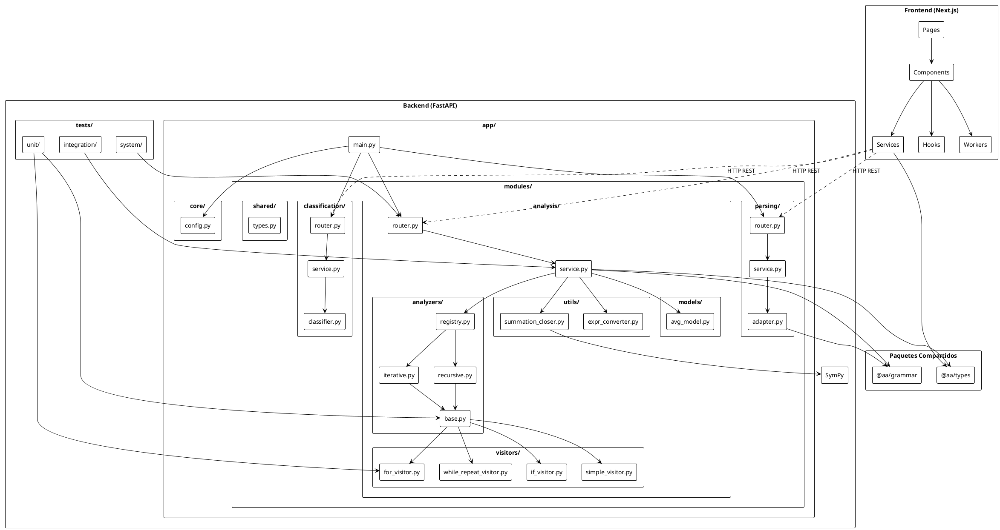

# Informe Técnico: Analizador de Complejidad Algorítmica

**Fecha**: Noviembre 2025  
**Versión**: 1.0

---

## Tabla de Contenidos

1. [Análisis de Complejidad del Sistema](#1-análisis-de-complejidad-del-sistema)
2. [Metodología Utilizada](#2-metodología-utilizada)
3. [Arquitectura del Sistema](#3-arquitectura-del-sistema)
4. [Técnicas Aplicadas](#4-técnicas-aplicadas)
5. [Ejemplos Resueltos](#5-ejemplos-resueltos)
6. [Cobertura de Tests](#6-cobertura-de-tests)

---

## 1. Análisis de Complejidad del Sistema

### 1.1 Descripción del Algoritmo

El sistema analiza la complejidad temporal de algoritmos expresados en pseudocódigo, determinando su función de eficiencia $T(n)$, su complejidad polinómica simplificada y sus cotas asintóticas ($O$, $\Omega$, $\Theta$).

**Entradas y Salidas:**
- **Entrada**: Código fuente del algoritmo a analizar (cadena de texto de longitud $L$)
- **Salida**: Objeto de análisis que contiene:
  - $T_{open}(n)$: Función de pasos exactos
  - $T_{poly}(n)$: Forma polinómica simplificada
  - Notaciones asintóticas: $O(f(n))$, $\Omega(g(n))$, $\Theta(h(n))$

### 1.2 Parámetros del Análisis

El algoritmo sigue un enfoque híbrido (secuencial en etapas, recursivo en el análisis del AST) con los siguientes parámetros:

- **$L$**: Longitud del código fuente (caracteres/tokens)
- **$N$**: Número de nodos en el Árbol de Sintaxis Abstracta (AST)
- **$D$**: Profundidad máxima de anidamiento de bucles/recursión
- **$S$**: Número de sumatorias a cerrar
- **$E$**: Costo de simplificación de expresiones simbólicas (SymPy)
- **$M$**: Número de nodos únicos cacheables (para memoización)

### 1.3 Flujo Principal

```text
función AnalyzeAlgorithm(source: string) -> AnalysisResult
  // 1. Parseo
  tokens <- Lexer(source)                      // C1 * L
  ast <- Parser(tokens)                        // C2 * L
  
  // 2. Clasificación
  tipo <- DetectAlgorithmKind(ast)             // C3 * N
  
  // 3. Selección de Estrategia (Patrón Strategy)
  si tipo = "recursive" entonces
      analyzer <- RecursiveAnalyzer()          // C4
  sino
      analyzer <- IterativeAnalyzer()          // C5
  fin-si
  
  // 4. Análisis (Visita del AST con Memoización)
  resultado_raw <- analyzer.visit(ast)         // T_visit(N, D, M)
  
  // 5. Post-procesamiento
  T_open <- analyzer.buildEquation()           // C6 * N
  T_poly <- Simplify(T_open)                   // C7 * S * E
  notaciones <- CalculateAsymptotics(T_poly)   // C8 * E
  
  retornar { T_open, T_poly, notaciones }
end-func
```

### 1.4 Análisis del Mejor Caso

**Condiciones:**
- Estructura plana sin bucles anidados profundos ($D = 1$)
- Pocas o ninguna sumatoria compleja ($S \approx 0$)
- Memoización ideal ($M \approx N$ o repetición nula)
- Expresiones triviales ($E \approx O(1)$)

**Ecuación de Eficiencia:**
$$ T_{best}(N, L) = C_{parse} \cdot L + C_{visit} \cdot N + C_{overhead} $$

**Notaciones Asintóticas:**
- $O(N + L)$: Cota superior
- $\Omega(N + L)$: Cota inferior
- $\Theta(N + L)$: Cota ajustada

$$ T_{best}(N) \in \Theta(N + L) \approx \Theta(N) $$

### 1.5 Análisis del Peor Caso

**Condiciones:**
- Anidamiento profundo ($D \approx N$ en casos extremos)
- Complejidad simbólica alta ($S$ grande, $E$ alto)
- Fallo de memoización ($M \approx 0$)
- Explosión de términos en simplificación simbólica

**Ecuación de Eficiencia:**
$$ T_{worst}(N, D, S, E) = C_{parse} \cdot L + C_{visit} \cdot (N \cdot D) + C_{sym} \cdot (S \cdot E) $$

**Notaciones Asintóticas:**
- $O(N \cdot D + S \cdot E + L)$: Cota superior
- $\Omega(N \cdot D + L)$: Cota inferior
- $\Theta(N \cdot D + S \cdot E + L)$: Cota ajustada

En el caso teórico más adverso donde $D \approx N$:
$$ T_{worst} \in O(N^2 + \text{costo\_algebraico}) $$

### 1.6 Análisis del Caso Promedio

**Modelo Probabilístico:**
- Estructura típica: anidamiento logarítmico ($D \approx \log N$ o $D \le 3$)
- Sumatorias moderadas ($S \approx \alpha \cdot N$)
- Memoización parcial ($M \approx 0.5 N$)
- Simplificaciones estándar

**Ecuación de Eficiencia:**
$$ T_{avg}(N) = C_{parse} \cdot L + E[T_{visit}] + E[T_{sym}] $$

$$ T_{avg}(N) \approx C_1 \cdot L + C_2 \cdot (N \cdot \log D) + C_3 \cdot (S \cdot \log E) $$

**Notaciones Asintóticas:**
- $O(N \cdot \log D + S \cdot \log E + L)$: Cota superior
- $\Omega(N \cdot \log D + L)$: Cota inferior
- $\Theta(N \cdot \log D + S \cdot \log E + L)$: Cota ajustada

$$ T_{avg}(N) \in \Theta(N \cdot \log D + S \cdot \log E + L) \approx \Theta(N \cdot \log N) $$

### 1.7 Memoización (Programación Dinámica)

El sistema implementa memoización en la fase de visita del AST:

**Mecanismo:**
- **Clave**: `Hash(Node) + Context(Multipliers) + Mode(Worst/Best/Avg)`
- **Almacenamiento**: Diccionario hash en memoria (`Dict[str, List[LineCost]]`)

**Impacto en la Eficiencia:**
- **Sin Memoización**: $O(N \cdot D)$ - cada nodo se re-evalúa
- **Con Memoización**: $O(N + M)$ - complejidad amortizada donde $M$ son los estados únicos

**Overhead:**
- **Espacial**: $O(M)$ para almacenar resultados parciales
- **Temporal**: $O(1)$ para generar claves de hash y búsquedas

### 1.8 Resumen de Complejidades

| Caso | $O$ (Cota Superior) | $\Omega$ (Cota Inferior) | $\Theta$ (Cota Ajustada) |
| :--- | :--- | :--- | :--- |
| **Mejor** | $O(N + L)$ | $\Omega(N + L)$ | $\Theta(N + L)$ |
| **Promedio** | $O(N \cdot \log D + S \cdot \log E + L)$ | $\Omega(N \cdot \log D + L)$ | $\Theta(N \cdot \log D + S \cdot \log E + L)$ |
| **Peor** | $O(N \cdot D + S \cdot E + L)$ | $\Omega(N \cdot D + L)$ | $\Theta(N \cdot D + S \cdot E + L)$ |

**Donde:**
- $N$: Número de nodos en el AST
- $L$: Longitud del código fuente
- $D$: Profundidad máxima de anidamiento
- $S$: Número de sumatorias a cerrar
- $E$: Factor de complejidad de simplificación simbólica

### 1.9 Observaciones Importantes

1. **Desacoplamiento**: La complejidad del *analizador* no depende de la complejidad temporal del *algoritmo analizado*. Analizar un algoritmo de $O(n!)$ no toma tiempo factorial, sino tiempo proporcional a la longitud de su código ($O(N)$).

2. **Cuello de Botella Real**: En la práctica, el parseo ($O(L)$) y la visita ($O(N)$) son muy rápidos. El verdadero cuello de botella suele ser el motor de álgebra simbólica (`SymPy`) cuando se enfrenta a expresiones matemáticas complejas ($S \cdot E$).

3. **Memoización Efectiva**: La memoización transforma el problema de visitar un árbol (potencialmente exponencial en caminos) en visitar un grafo de estados únicos (DAG), garantizando eficiencia incluso para códigos con estructuras repetitivas complejas.

---

## 2. Metodología Utilizada

### 2.1 Enfoque de Desarrollo

El proyecto se desarrolló siguiendo una metodología **Scrum** con planificación mediante **GitHub Projects**, organizando el trabajo en sprints de 2 semanas cada uno. Esta metodología permitió:

- Desarrollo modular basado en arquitectura por capas
- Separación clara entre frontend y backend (monorepo)
- Testing incremental (unitarios → integración → sistema)
- Documentación continua
- CI/CD automatizado con GitHub Actions

### 2.2 Plan de Sprints

El desarrollo se estructuró en **6 sprints** de 2 semanas cada uno:

#### Sprint 1 - Fundamentos del Analizador

**Objetivo**: Construir la base del proyecto.

**Entregables:**
- Configuración del monorepo (Next.js + FastAPI + Docker)
- Parser con ANTLR4 y AST unificado
- Normalización de sintaxis y reglas
- Infraestructura inicial con Docker Compose

#### Sprint 2 - Análisis Iterativo (Worst-Case) + Integración en Frontend

**Objetivo**: Resolver completamente análisis iterativo caso peor y mostrarlo visualmente.

**Entregables Backend:**
- Cálculo de complejidad por línea
- Identificación y conteo de bucles anidados
- Propagación de costos hasta Big-O (worst-case)
- Detección de branches (IF/ELSE) en peor caso
- Serialización de análisis en JSON

**Entregables Frontend:**
- Panel de resultados con Big-O final
- Visualización de costo por línea
- Árbol de bloques iterativos
- Visualización clara en la UI del análisis worst-case

#### Sprint 3 - Best & Average Case + SymPy + Chatbot (LLM)

**Objetivo**: Completar análisis iterativo en los 3 casos y añadir capacidades simbólicas + LLM.

**Entregables Backend:**
- Motor de selección de caminos (mejor caso y caso promedio)
- Integración con SymPy para:
  - Simplificación de expresiones
  - Cálculo simbólico de polinomios, logs, sumatorias y recurrencias simples
- Chatbot LLM:
  - Explicación del análisis
  - Preguntas sobre el código
  - Interpretación del algoritmo paso a paso

**Entregables Frontend:**
- Panel Best / Average / Worst side-by-side
- Chat panel acoplado al algoritmo

#### Sprint 4 - Extracción de Recurrencias

**Objetivo**: Generar $T(n)$ automáticamente desde pseudocódigo recursivo.

**Entregables:**
- Identificación de llamadas recursivas (1 rama, multi-rama, divide-and-conquer)
- Extracción de parámetros: $n$, $n-1$, $n-k$, $n/b$
- Construcción del modelo $\langle a, b, f(n) \rangle$
- Detección de:
  - Subproblemas independientes
  - Costos por nivel
  - Parámetros ambiguos
- Representación en JSON para UI
- Preprocesamiento con memoization para evitar múltiples extracciones

#### Sprint 5 - Clasificador de Recurrencias + Métodos de Análisis + IA (Repair & Compare Analysis)

**Objetivo**: Resolver $T(n)$ automáticamente y validar errores con IA.

**Entregables:**
- **Clasificador de Recurrencias:**
  - Identificación automática de tipo Master Theorem $(a, b, f(n))$
  - Recurrencias con desplazamiento lineal $T(n) = T(n-1) + \ldots$
  - Recurrencias exponenciales
  - Recurrencias polilogarítmicas

- **Solver matemático:**
  - Teorema Maestro (3 casos + subcasos)
  - Método de Iteración
  - Árbol de Recursión
  - Ecuación Característica (lineal homogénea y no homogénea)

- **SymPy para:**
  - Polinomios
  - Sumatorias
  - Logs
  - Límites

- **IA Repair & Compare Analysis:**
  - Detección automática de errores en pseudocódigo recursivo
  - Reparación sugerida del algoritmo
  - Comparación entre algoritmo original y corregido
  - Resumen de diferencias y cambios de complejidad

#### Sprint 6 - Calidad, Tests, Cobertura, Documentación y CI/CD

**Objetivo**: Cerrar versión 1.0 con calidad de ingeniería.

**Entregables:**
- **Calidad:**
  - Linter completo (Ruff)
  - Integración Black / Prettier
  - Pruebas unitarias + integración
  - Cobertura (pytest + coverage.py) - **71.48% alcanzado**

- **Documentación:**
  - Docs técnicas del analizador
  - Manual del usuario (con ejemplos)
  - Guía de estructura del pseudocódigo soportado

- **CI/CD:**
  - Pipeline de despliegue con GitHub Actions
  - Build containers
  - Tests automatizados
  - Deploy automático (API y frontend)

---

## 3. Arquitectura del Sistema

### 3.1 Diagrama de Arquitectura



### 3.2 Estructura Modular del Backend

El backend está organizado en una arquitectura modular clara que sigue el principio de responsabilidad única. La estructura principal se encuentra en `apps/api/app/`:

```
apps/api/
├── app/
│   ├── main.py                 # Punto de entrada FastAPI
│   ├── core/                   # Configuración central
│   │   └── config.py          # Variables de entorno y configuración
│   └── modules/                # Módulos funcionales
│       ├── parsing/            # Módulo de parseo
│       ├── analysis/           # Módulo de análisis
│       ├── classification/     # Módulo de clasificación
│       └── shared/             # Utilidades compartidas
└── tests/                      # Suite de pruebas
    ├── unit/                   # Tests unitarios
    ├── integration/            # Tests de integración
    └── system/                 # Tests del sistema completo
```

#### Módulo de Parseo (`modules/parsing/`)

**Responsabilidad**: Convertir código fuente en AST

**Estructura:**
```
modules/parsing/
├── router.py      # Endpoint POST /grammar/parse
├── service.py     # Lógica de negocio de parseo
├── adapter.py     # Adaptador para el parser ANTLR4
└── schemas.py     # Modelos Pydantic para request/response
```

**Componentes:**
- `router.py`: Define el endpoint REST `/grammar/parse` que recibe código fuente y retorna AST o errores
- `service.py`: Orquesta el proceso de parseo, maneja errores y formatea respuestas
- `adapter.py`: Adapta la interfaz del parser ANTLR4 (`@aa/grammar`) al formato interno
- `schemas.py`: Define los modelos de datos para validación con Pydantic

**Integración**: Utiliza el paquete `@aa/grammar` generado con ANTLR4

#### Módulo de Análisis (`modules/analysis/`)

**Responsabilidad**: Análisis de complejidad temporal

**Estructura:**
```
modules/analysis/
├── router.py           # Endpoints POST /analyze/*
├── service.py          # Orquestación del análisis
├── schemas.py          # Modelos de datos
├── analyzers/          # Implementaciones de analizadores
│   ├── base.py         # Clase base con utilidades comunes
│   ├── iterative.py    # Analizador para algoritmos iterativos
│   ├── recursive.py    # Analizador para algoritmos recursivos
│   ├── registry.py     # Registry (Patrón Strategy)
│   └── dummy.py        # Analizador dummy para pruebas
├── visitors/           # Visitantes del AST (Visitor Pattern)
│   ├── for_visitor.py           # Análisis de bucles FOR
│   ├── while_repeat_visitor.py  # Análisis de bucles WHILE/REPEAT
│   ├── if_visitor.py           # Análisis de condicionales IF/ELSE
│   └── simple_visitor.py       # Análisis de sentencias simples
├── utils/              # Utilidades de análisis
│   ├── summation_closer.py      # Cierre de sumatorias con SymPy
│   ├── expr_converter.py       # Conversión de expresiones
│   └── complexity_classes.py   # Clasificación de complejidad
└── models/            # Modelos de datos especializados
    └── avg_model.py   # Modelo probabilístico para caso promedio
```

**Componentes principales:**

- **`router.py`**: Define endpoints REST:
  - `POST /analyze/open`: Análisis completo de complejidad
  - `POST /analyze/detect-methods`: Detección de métodos aplicables

- **`service.py`**: Orquesta el flujo completo:
  1. Parseo del código fuente
  2. Clasificación del tipo de algoritmo
  3. Selección del analizador apropiado (Strategy Pattern)
  4. Ejecución del análisis en los modos solicitados (worst/best/avg)
  5. Formateo de resultados

- **`analyzers/`**: Implementaciones de analizadores:
  - `base.py`: Clase abstracta con funcionalidades comunes (memoización, construcción de ecuaciones, etc.)
  - `iterative.py`: Analiza algoritmos iterativos recorriendo el AST
  - `recursive.py`: Analiza algoritmos recursivos extrayendo y resolviendo recurrencias
  - `registry.py`: Registry que implementa el Patrón Strategy para seleccionar el analizador correcto

- **`visitors/`**: Visitantes especializados del AST:
  - Cada visitante maneja un tipo específico de constructo del lenguaje
  - Implementan el Visitor Pattern para separar el recorrido del AST de la lógica de análisis

- **`utils/`**: Utilidades matemáticas y de conversión:
  - `summation_closer.py`: Utiliza SymPy para cerrar sumatorias y obtener formas cerradas
  - `expr_converter.py`: Convierte expresiones entre formatos (SymPy, LaTeX, texto)
  - `complexity_classes.py`: Determina las notaciones asintóticas ($O$, $\Omega$, $\Theta$)

- **`models/`**: Modelos de datos:
  - `avg_model.py`: Implementa modelos probabilísticos (uniforme, simbólico) para caso promedio

#### Módulo de Clasificación (`modules/classification/`)

**Responsabilidad**: Identificar el tipo de algoritmo

**Estructura:**
```
modules/classification/
├── router.py      # Endpoint POST /classify
├── service.py     # Lógica de clasificación
├── classifier.py  # Clasificador heurístico basado en AST
└── schemas.py     # Modelos de datos
```

**Componentes:**
- `router.py`: Define el endpoint `/classify` que identifica el tipo de algoritmo
- `service.py`: Orquesta el proceso de clasificación
- `classifier.py`: Implementa heurísticas para detectar si un algoritmo es iterativo, recursivo o híbrido basándose en el AST
- `schemas.py`: Define los modelos de respuesta

#### Módulo Core (`core/`)

**Responsabilidad**: Configuración y utilidades centrales

**Componentes:**
- `config.py`: Maneja variables de entorno, configuración de CORS, y settings globales

#### Módulo Shared (`modules/shared/`)

**Responsabilidad**: Tipos y utilidades compartidas entre módulos

**Componentes:**
- `types.py`: Definiciones de tipos compartidos (LineCost, etc.)

#### Suite de Tests (`tests/`)

**Estructura:**
```
tests/
├── unit/              # Tests unitarios de componentes aislados
│   ├── test_base_analyzer.py
│   ├── test_for_visitor.py
│   ├── test_if_visitor.py
│   └── ...
├── integration/        # Tests de integración entre componentes
│   ├── test_iterative_analyzer.py
│   ├── test_recursive_algorithms.py
│   ├── test_algorithms.py
│   └── ...
└── system/            # Tests del sistema completo (endpoints HTTP)
    ├── test_analysis_endpoints.py
    ├── test_parse_endpoint.py
    └── ...
```

**Cobertura**: 71.48% del código está cubierto por tests

### 3.3 Arquitectura del Frontend

El frontend utiliza **Next.js 14 App Router** con una arquitectura basada en componentes y separación de responsabilidades:

#### Estructura de Carpetas
```
apps/web/src/
├── app/                    # Páginas (Next.js App Router)
│   ├── page.tsx           # Página principal (home)
│   ├── analyzer/          # Página de resultados del análisis
│   │   ├── page.tsx
│   │   └── analyzer-helpers.ts
│   ├── user-guide/        # Guía de usuario
│   ├── documentation/     # Documentación técnica
│   ├── examples/          # Ejemplos de algoritmos
│   ├── about-us/          # Acerca del proyecto
│   ├── api/               # API Routes (Next.js)
│   │   ├── analyze/      # Proxies para endpoints de análisis
│   │   ├── grammar/       # Proxies para endpoints de parseo
│   │   └── llm/           # Endpoints para integración LLM
│   ├── layout.tsx         # Layout raíz
│   └── globals.css        # Estilos globales
├── components/            # Componentes React reutilizables
│   ├── AnalyzerEditor.tsx      # Editor Monaco con validación
│   ├── AnalysisLoader.tsx      # Loader de progreso animado
│   ├── IterativeAnalysisView.tsx   # Vista para algoritmos iterativos
│   ├── RecursiveAnalysisView.tsx   # Vista para algoritmos recursivos
│   ├── LineTable.tsx            # Tabla de costos por línea
│   ├── CostsTable.tsx         # Tabla de costos agregados
│   ├── AIModeView.tsx        # Vista del modo AI con chatbot
│   ├── ManualModeView.tsx     # Vista del modo manual
│   ├── ChatBot.tsx            # Componente del chatbot
│   ├── RepairModal.tsx        # Modal de reparación de código
│   ├── ComparisonModal.tsx    # Modal de comparación de análisis
│   ├── RecursionTreeModal.tsx # Modal de árbol de recursión
│   ├── CharacteristicEquationModal.tsx # Modal de ecuación característica
│   └── ...                  # Más componentes UI
├── hooks/                 # Hooks personalizados
│   ├── useAnalysisProgress.ts  # Manejo de progreso de análisis
│   ├── useApiKey.ts           # Gestión de API key (localStorage)
│   ├── useChatHistory.ts      # Historial de chat
│   ├── useParseWorker.ts      # Web Worker para parseo
│   └── ...
├── contexts/              # Contextos React (estado global)
│   ├── GlobalLoaderContext.tsx    # Loader global
│   └── NavigationContext.tsx      # Estado de navegación
├── services/              # Servicios (API clients)
│   └── grammar-api.ts     # Cliente para API de parseo
├── lib/                   # Utilidades y helpers
│   ├── algorithm-classifier.ts    # Clasificación de algoritmos
│   ├── polynomial.ts              # Operaciones con polinomios
│   ├── asymptotic-notation.ts     # Cálculo de notaciones asintóticas
│   ├── recursion-tree-generator.ts # Generación de árboles de recursión
│   ├── katex.ts                   # Configuración de KaTeX
│   └── ...
├── workers/               # Web Workers (procesamiento en background)
│   └── parser.worker.ts   # Worker para parseo sin bloquear UI
├── types/                 # Tipos TypeScript
│   ├── documentation.ts
│   └── loader.ts
└── styles/                # Estilos adicionales
    └── highlight.css      # Syntax highlighting
```

#### Flujo de Datos

```
Usuario → Componente → Hook/Context → Service → API Backend
                ↓
         Estado Local/Global
                ↓
         Actualización UI
```

#### Flujo de Análisis Completo

1. **Usuario escribe código** → `AnalyzerEditor`
2. **Validación en tiempo real** → Web Worker (parseo en background)
3. **Usuario inicia análisis** → `AnalysisLoader`
4. **Progreso animado** → `useAnalysisProgress`
5. **Llamada a API** → Service (HTTP REST)
6. **Resultados** → `IterativeAnalysisView` o `RecursiveAnalysisView`
7. **Navegación** → `/analyzer` con resultados

### 3.4 Paquetes Compartidos (Monorepo)

El proyecto utiliza un **monorepo** con paquetes compartidos que permiten reutilización de código entre frontend y backend:

#### `@aa/grammar`

**Ubicación**: `packages/grammar/`

**Responsabilidad**: Gramática ANTLR4 compartida y generación de parsers

**Estructura:**
```
packages/grammar/
├── grammar/
│   └── Language.g4        # Gramática ANTLR4
├── src/
│   └── ts/                # Parser generado para TypeScript
└── py/
    └── src/               # Parser generado para Python
```

**Características:**
- Gramática LL(*) / ALL(*) definida en ANTLR4
- Generación automática de parsers para TypeScript y Python
- AST canónico unificado entre frontend y backend
- Scripts de generación: `gen-ts.js`, `gen-py.js`

**Uso:**
- Frontend: Parseo en tiempo real con Web Worker
- Backend: Parseo en el servidor para análisis

#### `@aa/types`

**Ubicación**: `packages/types/`

**Responsabilidad**: Definiciones de tipos TypeScript compartidas

**Estructura:**
```
packages/types/
└── src/
    └── index.ts           # Definiciones de tipos
```

**Tipos definidos:**
- Interfaces para nodos del AST (`Program`, `ProcDef`, `For`, `If`, etc.)
- Tipos para análisis (`AnalyzeOpenResponse`, `LineCost`, `RecurrenceInfo`, etc.)
- Tipos para clasificación (`AlgorithmKind`, `AnalysisMethod`, etc.)
- Sincronización entre frontend y backend mediante tipos compartidos

**Ventajas:**
- Type-safety end-to-end
- Documentación implícita de la API
- Detección temprana de errores de compatibilidad

### 3.5 Comunicación API REST

La comunicación entre frontend y backend se realiza mediante **API REST**:

- **Endpoints principales:**
  - `POST /grammar/parse`: Parseo de código
  - `POST /analyze/open`: Análisis de complejidad
  - `POST /analyze/detect-methods`: Detección de métodos aplicables
  - `POST /classify`: Clasificación de algoritmo

- **Formato**: JSON bidireccional
- **Validación**: Pydantic en backend, TypeScript en frontend

---

## 4. Técnicas Aplicadas

### 4.1 Patrón Strategy

El sistema implementa el **Patrón Strategy** mediante `AnalyzerRegistry` para seleccionar dinámicamente el analizador apropiado según el tipo de algoritmo detectado.

**Implementación:**
```python
# apps/api/app/modules/analysis/analyzers/registry.py
AnalyzerRegistry = {
    "iterative": IterativeAnalyzer,
    "recursive": RecursiveAnalyzer,
    "hybrid": RecursiveAnalyzer,
    "dummy": DummyAnalyzer
}
```

**Uso:**
```python
# El servicio selecciona el analizador según el tipo detectado
algorithm_kind = detect_algorithm_kind(ast)
analyzer_class = AnalyzerRegistry.get(algorithm_kind)
analyzer = analyzer_class()
result = analyzer.analyze(ast, mode, ...)
```

**Ventajas:**
- Desacoplamiento entre detección y análisis
- Extensibilidad: fácil agregar nuevos tipos de analizadores
- Polimorfismo: misma interfaz para diferentes estrategias

### 4.2 Memoización (Programación Dinámica)

El sistema implementa **memoización** para optimizar el análisis de algoritmos con estructuras repetitivas.

**Mecanismo:**
- **Clave de cache**: `"{node_id}|{mode}|{context_hash}"`
  - `node_id`: Identificador estable del nodo (posición o hash)
  - `mode`: Modo de análisis (`worst`, `best`, `avg`)
  - `context_hash`: Hash del `loop_stack` (bucles anidados activos)
- **Almacenamiento**: Diccionario hash en memoria (`Dict[str, List[LineCost]]`)

**Activación automática:**
- Bloques de código (`Block`): Se cachean resultados completos
- Bucles (`For`, `While`, `Repeat`): Se cachean análisis de cuerpos
- Condicionales (`If`): Se cachean ramas THEN y ELSE por separado

**Impacto:**
- **Sin memoización**: $O(N \cdot D)$ - re-evaluación de nodos
- **Con memoización**: $O(N + M)$ - complejidad amortizada

### 4.3 Visitor Pattern

El sistema utiliza el **Visitor Pattern** para recorrer el AST mediante visitantes especializados:

**Visitantes implementados:**
- `ForVisitor`: Análisis de bucles FOR
- `WhileRepeatVisitor`: Análisis de bucles WHILE/REPEAT
- `IfVisitor`: Análisis de condicionales IF/ELSE
- `SimpleVisitor`: Análisis de sentencias simples (asignaciones, returns, etc.)

**Ventajas:**
- Separación de responsabilidades: cada visitante maneja un tipo de nodo
- Extensibilidad: fácil agregar nuevos tipos de análisis
- Mantenibilidad: código organizado por tipo de constructo

### 4.4 Computación Simbólica (SymPy)

El sistema integra **SymPy** para operaciones matemáticas simbólicas:

**Aplicaciones:**
- **Cierre de sumatorias**: Resolución de formas cerradas de sumatorias anidadas
- **Simplificación de expresiones**: Reducción de expresiones polinómicas complejas
- **Resolución de recurrencias**: Cálculo de soluciones de ecuaciones de recurrencia
- **Cálculo de límites**: Para determinar notaciones asintóticas

**Ejemplo de uso:**
```python
from sympy import Symbol, Sum, simplify

n = Symbol('n')
# Cerrar sumatoria: Σ(i=1 to n) i = n(n+1)/2
sum_expr = Sum(i, (i, 1, n))
closed_form = simplify(sum_expr.doit())  # n*(n + 1)/2
```

### 4.5 Parser Generado (ANTLR4)

El sistema utiliza **ANTLR4** para generar parsers a partir de una gramática:

**Gramática:**
- Definida en `packages/grammar/grammar/Language.g4`
- Tipo: LL(*) / ALL(*)
- Genera parsers para TypeScript y Python

**Ventajas:**
- Mantenibilidad: gramática centralizada
- Consistencia: mismo parser para frontend y backend
- Extensibilidad: fácil agregar nuevas construcciones

### 4.6 Modelos Probabilísticos

El sistema implementa modelos probabilísticos para el análisis de **caso promedio**:

**Modelos implementados:**
- **Modelo Uniforme**: Distribución uniforme de probabilidades
- **Modelo Simbólico**: Expresiones simbólicas para probabilidades

**Aplicación:**
- Cálculo de esperanza matemática $E[N_\ell]$ para cada línea $\ell$
- Consideración de early returns y condiciones probabilísticas
- Generación de procedimientos paso a paso en LaTeX

### 4.7 Métodos de Resolución de Recurrencias

El sistema implementa **cuatro métodos** para resolver recurrencias recursivas:

#### 4.7.1 Teorema Maestro
Para recurrencias divide-and-conquer estándar:
$$ T(n) = a \cdot T(n/b) + f(n) $$

**Casos:**
1. $f(n) < n^{\log_b a}$: $T(n) = \Theta(n^{\log_b a})$
2. $f(n) = n^{\log_b a}$: $T(n) = \Theta(n^{\log_b a} \log n)$
3. $f(n) > n^{\log_b a}$: $T(n) = \Theta(f(n))$

#### 4.7.2 Método de Iteración
Despliega la recurrencia iterativamente para obtener forma cerrada:
$$ T(n) = T(n-1) + g(n) \Rightarrow T(n) = T(0) + \sum_{i=1}^{n} g(i) $$

#### 4.7.3 Árbol de Recursión
Visualiza el árbol de llamadas recursivas para divide-and-conquer:
- Construcción del árbol nivel por nivel
- Cálculo de costos por nivel
- Suma de costos totales

#### 4.7.4 Ecuación Característica
Para recurrencias lineales homogéneas y no homogéneas:
- Resolución de ecuación característica $r^k - a_1 r^{k-1} - \ldots - a_k = 0$
- Solución homogénea y particular
- Aplicación de condiciones iniciales

**Detección automática:**
El sistema detecta automáticamente qué métodos son aplicables según el tipo de recurrencia detectada.

---

## 5. Ejemplos Resueltos

A continuación se presentan ejemplos representativos de cada categoría de algoritmos analizados por el sistema.

### 5.1 Algoritmos Iterativos

#### Ejemplo 1: Búsqueda Lineal

**Pseudocódigo:**
```pseudocode
busquedaLineal(A[n], x, n) BEGIN
    FOR i <- 1 TO n DO BEGIN
        IF (A[i] = x) THEN BEGIN
            RETURN i;
        END
    END
    RETURN -1;
END
```

**Análisis Worst Case:**
- **T_open**: $C_{1} \cdot (n + 1) + C_{2} \cdot n + C_{4}$
- **T_polynomial**: $(C_{1} + C_{2}) \cdot n + (C_{1} + C_{4})$
- **Notaciones Asintóticas:**
  - $O(n)$
  - $\Omega(n)$
  - $\Theta(n)$

**Análisis Best Case:**
- **T_open**: $C$ (early return en primera iteración)
- **Notaciones Asintóticas:**
  - $O(1)$
  - $\Omega(1)$
  - $\Theta(1)$

**Análisis Average Case:**
- **T_open**: $C_{1} \cdot (\frac{n}{2} + \frac{3}{2}) + C_{2} \cdot (\frac{n}{2} + \frac{1}{2}) + C_{3}$
- **T_polynomial**: $(C_{1} + C_{2}) \cdot \frac{1}{2} \cdot n + (C_{3}) + (C_{2}) \cdot \frac{1}{2} + (C_{1}) \cdot \frac{3}{2}$
- **Notaciones Asintóticas:**
  - $O(n)$
  - $\Omega(n)$
  - $\Theta(n)$

**Tiempo de Ejecución:**
- Parse: 0.025s
- Clasificación: 0.015s
- Análisis: 0.495s
- **Total**: 0.535s

---

#### Ejemplo 2: Factorial Iterativo

**Pseudocódigo:**
```pseudocode
factorial(n) BEGIN
    resultado <- 1;
    FOR i <- 2 TO n DO BEGIN
        resultado <- resultado * i;
    END
    RETURN resultado;
END
```

**Análisis Worst Case:**
- **T_open**: $C_{1} + C_{2} \cdot n + C_{3} \cdot (n - 1) + C_{4} \cdot (n - 1) + C_{5}$
- **T_polynomial**: $(C_{2} + C_{3} + C_{4}) \cdot n - (C_{3} + C_{4}) + (C_{1} + C_{5})$
- **Notaciones Asintóticas:**
  - $O(n)$
  - $\Omega(n)$
  - $\Theta(n)$

**Tiempo de Ejecución:**
- Parse: 0.012s
- Clasificación: 0.014s
- Análisis: 0.234s
- **Total**: 0.260s

---

#### Ejemplo 3: Suma de Array

**Pseudocódigo:**
```pseudocode
sumaArray(A[n], n) BEGIN
    suma <- 0;
    FOR i <- 1 TO n DO BEGIN
        suma <- suma + A[i];
    END
    RETURN suma;
END
```

**Análisis Worst Case:**
- **T_open**: $2n + 3$
- **T_polynomial**: $(C_{2} + C_{3} + C_{4} + C_{5}) \cdot n + (C_{1} + C_{2} + C_{6})$
- **Notaciones Asintóticas:**
  - $O(n)$
  - $\Omega(n)$
  - $\Theta(n)$

**Tiempo de Ejecución:**
- Parse: 0.016s
- Clasificación: 0.014s
- Análisis: 0.266s
- **Total**: 0.296s

---

### 5.2 Algoritmos Recursivos - Método Iterativo

#### Ejemplo 1: Factorial Recursivo

**Pseudocódigo:**
```pseudocode
factorial(n) BEGIN
    IF (n <= 1) THEN BEGIN
        RETURN 1;
    END
    ELSE BEGIN
        RETURN n * factorial(n - 1);
    END
END
```

**Método Aplicable**: `iteration`

**Análisis:**
- **Recurrencia detectada**: $T(n) = T(n-1) + O(1)$
- **Forma cerrada**: $T(n) = \Theta(n)$
- **Notaciones Asintóticas:**
  - $O(n)$
  - $\Omega(n)$
  - $\Theta(n)$

**Tiempo de Ejecución:**
- Parse: 0.010s
- Clasificación: 0.012s
- Detección de métodos: 0.014s
- Análisis: 0.052s
- **Total**: 0.087s

---

#### Ejemplo 2: Suma de Array Recursiva

**Pseudocódigo:**
```pseudocode
sumaArray(A[n], n) BEGIN
    IF (n = 0) THEN BEGIN
        RETURN 0;
    END
    ELSE BEGIN
        RETURN A[n] + sumaArray(A, n - 1);
    END
END
```

**Método Aplicable**: `characteristic_equation`, `iteration`

**Análisis:**
- **Recurrencia detectada**: $T(n) = T(n-1) + g(n)$ (linear shift)
- **Ecuación característica**: $r - 1 = 0$ (raíz: $r = 1$)
- **Forma cerrada**: $T(n) = \Theta(n)$
- **Notaciones Asintóticas:**
  - $O(n)$
  - $\Omega(n)$
  - $\Theta(n)$

**Tiempo de Ejecución:**
- Parse: 0.010s
- Clasificación: 0.012s
- Detección de métodos: 0.014s
- Análisis: 0.052s
- **Total**: 0.087s

---

#### Ejemplo 3: Búsqueda en Lista Enlazada

**Pseudocódigo:**
```pseudocode
buscarLista(nodo, valor) BEGIN
    IF (nodo = null) THEN BEGIN
        RETURN false;
    END
    IF (nodo.valor = valor) THEN BEGIN
        RETURN true;
    END
    ELSE BEGIN
        RETURN buscarLista(nodo.siguiente, valor);
    END
END
```

**Método Aplicable**: `characteristic_equation`, `iteration`

**Análisis:**
- **Recurrencia detectada**: $T(n) = T(n-1) + g(n)$ (linear shift)
- **Ecuación característica**: $r - 1 = 0$ (raíz: $r = 1$)
- **Forma cerrada**: $T(n) = \Theta(n)$
- **Best Case**: $O(1)$ (early return)
- **Notaciones Asintóticas:**
  - $O(n)$
  - $\Omega(n)$
  - $\Theta(n)$

**Tiempo de Ejecución:**
- Parse: 0.014s
- Clasificación: 0.012s
- Detección de métodos: 0.013s
- Análisis: 0.033s
- **Total**: 0.072s

---

### 5.3 Algoritmos Recursivos - Teorema Maestro

#### Ejemplo 1: Búsqueda Binaria Recursiva

**Pseudocódigo:**
```pseudocode
busquedaBinaria(A[n], x, inicio, fin) BEGIN
    IF (inicio > fin) THEN BEGIN
        RETURN -1;
    END
    mitad <- (inicio + fin) / 2;
    IF (A[mitad] = x) THEN BEGIN
        RETURN mitad;
    END
    ELSE IF (A[mitad] > x) THEN BEGIN
        RETURN busquedaBinaria(A, x, inicio, mitad - 1);
    END
    ELSE BEGIN
        RETURN busquedaBinaria(A, x, mitad + 1, fin);
    END
END
```

**Método Aplicable**: `master`

**Análisis:**
- **Recurrencia detectada**: $T(n) = 1 \cdot T(n/2) + f(n)$ (divide-and-conquer)
- **Aplicación del Teorema Maestro**: Caso 2 ($f(n) = \Theta(n^{\log_b a})$)
- **Forma cerrada**: $T(n) = \Theta(\log n)$
- **Notaciones Asintóticas:**
  - $O(\log n)$
  - $\Omega(\log n)$
  - $\Theta(\log n)$

**Tiempo de Ejecución:**
- Parse: 0.020s
- Clasificación: 0.021s
- Detección de métodos: 0.018s
- Análisis: 0.022s
- **Total**: 0.080s

---

#### Ejemplo 2: QuickSort (Caso Promedio)

**Pseudocódigo:**
```pseudocode
quicksort(A[n], inicio, fin) BEGIN
    IF (inicio < fin) THEN BEGIN
        pivote <- particionar(A, inicio, fin);
        CALL quicksort(A, inicio, pivote - 1);
        CALL quicksort(A, pivote + 1, fin);
    END
END
```

**Método Aplicable**: `master`, `recursion_tree`

**Análisis:**
- **Recurrencia detectada**: $T(n) = 2 \cdot T(n/2) + f(n)$ (divide-and-conquer)
- **Aplicación del Teorema Maestro**: Caso 2
- **Forma cerrada**: $T(n) = \Theta(n \log n)$
- **Notaciones Asintóticas:**
  - $O(n \log n)$
  - $\Omega(n \log n)$
  - $\Theta(n \log n)$

**Tiempo de Ejecución:**
- Parse: 0.015s
- Clasificación: 0.016s
- Detección de métodos: 0.013s
- Análisis: 0.028s
- **Total**: 0.072s

---

#### Ejemplo 3: Exponentiación Rápida Recursiva

**Pseudocódigo:**
```pseudocode
exponenciacionRapida(x, n) BEGIN
    IF (n = 0) THEN BEGIN
        RETURN 1;
    END
    resultado <- exponenciacionRapida(x, n DIV 2);
    resultado <- resultado * resultado;
    IF (n MOD 2 = 1) THEN BEGIN
        resultado <- resultado * x;
    END
    RETURN resultado;
END
```

**Método Aplicable**: `master`

**Análisis:**
- **Recurrencia detectada**: $T(n) = 1 \cdot T(n/2) + f(n)$ (divide-and-conquer)
- **Aplicación del Teorema Maestro**: Caso 2
- **Forma cerrada**: $T(n) = \Theta(\log n)$
- **Notaciones Asintóticas:**
  - $O(\log n)$
  - $\Omega(\log n)$
  - $\Theta(\log n)$

**Tiempo de Ejecución:**
- Parse: 0.015s
- Clasificación: 0.017s
- Detección de métodos: 0.017s
- Análisis: 0.027s
- **Total**: 0.076s

---

### 5.4 Algoritmos Recursivos - Árbol de Recursión

#### Ejemplo 1: MergeSort

**Pseudocódigo:**
```pseudocode
mergesort(A[n], inicio, fin) BEGIN
    IF (inicio < fin) THEN BEGIN
        medio <- (inicio + fin) / 2;
        CALL mergesort(A, inicio, medio);
        CALL mergesort(A, medio + 1, fin);
        CALL mezclar(A, inicio, medio, fin);
    END
END
```

**Método Aplicable**: `recursion_tree`, `master`

**Análisis:**
- **Recurrencia detectada**: $T(n) = 2 \cdot T(n/2) + f(n)$
- **Árbol de recursión**: Construido nivel por nivel
- **Forma cerrada**: $T(n) = \Theta(n \log n)$
- **Notaciones Asintóticas:**
  - $O(n \log n)$
  - $\Omega(n \log n)$
  - $\Theta(n \log n)$

**Tiempo de Ejecución:**
- Parse: 0.018s
- Clasificación: 0.019s
- Detección de métodos: 0.015s
- Análisis: 0.145s
- **Total**: 0.197s

---

#### Ejemplo 2: Algoritmo Divide Desigual

**Pseudocódigo:**
```pseudocode
algoritmoDivideDesigual(arreglo, inicio, fin) BEGIN
    IF (fin - inicio <= 1) THEN BEGIN
        RETURN arreglo[inicio];
    END
    ELSE BEGIN
        medio1 <- inicio + (fin - inicio) DIV 3;
        medio2 <- inicio + 2 * (fin - inicio) DIV 3;
        resultado1 <- algoritmoDivideDesigual(arreglo, inicio, medio1);
        resultado2 <- algoritmoDivideDesigual(arreglo, medio1, medio2);
        resultado3 <- algoritmoDivideDesigual(arreglo, medio2, fin);
        RETURN resultado1 + resultado2 + resultado3;
    END
END
```

**Método Aplicable**: `recursion_tree`, `master`

**Análisis:**
- **Recurrencia detectada**: $T(n) = 3 \cdot T(n/3) + f(n)$ (divide-and-conquer)
- **Aplicación del Teorema Maestro**: Caso 1
- **Forma cerrada**: $T(n) = \Theta(n)$
- **Notaciones Asintóticas:**
  - $O(n)$
  - $\Omega(n)$
  - $\Theta(n)$

**Tiempo de Ejecución:**
- Parse: 0.023s
- Clasificación: 0.020s
- Detección de métodos: 0.021s
- Análisis: 0.056s
- **Total**: 0.119s

---

#### Ejemplo 3: QuickSort (Ordenamiento Rápido)

**Pseudocódigo:**
```pseudocode
quicksort(A[n], izq, der) BEGIN
    IF (izq < der) THEN BEGIN
        pivot <- A[der];
        i <- izq - 1;
        FOR j <- izq TO der - 1 DO BEGIN
            IF (A[j] <= pivot) THEN BEGIN
                i <- i + 1;
                temp <- A[i];
                A[i] <- A[j];
                A[j] <- temp;
            END
        END
        temp <- A[i + 1];
        A[i + 1] <- A[der];
        A[der] <- temp;
        pi <- i + 1;
        CALL quicksort(A, izq, pi - 1);
        CALL quicksort(A, pi + 1, der);
    END
END
```

**Método Aplicable**: `recursion_tree`, `master`

**Análisis:**
- **Recurrencia detectada**: $T(n) = 2 \cdot T(n/2) + f(n)$ (divide-and-conquer)
- **Aplicación del Teorema Maestro**: Caso 2
- **Forma cerrada**: $T(n) = \Theta(n \log n)$
- **Notaciones Asintóticas:**
  - $O(n \log n)$
  - $\Omega(n \log n)$
  - $\Theta(n \log n)$

**Tiempo de Ejecución:**
- Parse: 0.020s
- Clasificación: 0.020s
- Detección de métodos: 0.018s
- Análisis: 0.135s
- **Total**: 0.193s

---

### 5.5 Algoritmos Recursivos - Ecuación Característica

#### Ejemplo 1: Fibonacci Recursivo

**Pseudocódigo:**
```pseudocode
fibonacci(n) BEGIN
    IF (n <= 1) THEN BEGIN
        RETURN n;
    END
    ELSE BEGIN
        RETURN fibonacci(n - 1) + fibonacci(n - 2);
    END
END
```

**Método Aplicable**: `characteristic_equation`

**Análisis:**
- **Recurrencia detectada**: $T(n) = T(n-1) + T(n-2) + g(n)$ (lineal homogénea de orden 2)
- **Ecuación característica**: $r^2 - r - 1 = 0$
- **Raíces**: $r_1 = \frac{1 + \sqrt{5}}{2}$, $r_2 = \frac{1 - \sqrt{5}}{2}$
- **Forma cerrada**: $T(n) = \Theta\left(\left(\frac{1 + \sqrt{5}}{2}\right)^n\right)$
- **Notaciones Asintóticas:**
  - $O\left(\left(\frac{1 + \sqrt{5}}{2}\right)^n\right)$
  - $\Omega\left(\left(\frac{1 + \sqrt{5}}{2}\right)^n\right)$
  - $\Theta\left(\left(\frac{1 + \sqrt{5}}{2}\right)^n\right)$

**Tiempo de Ejecución:**
- Parse: 0.012s
- Clasificación: 0.013s
- Detección de métodos: 0.012s
- Análisis: 0.250s
- **Total**: 0.287s

---

#### Ejemplo 2: Torres de Hanoi

**Pseudocódigo:**
```pseudocode
hanoi(n, origen, destino, auxiliar) BEGIN
    IF (n = 1) THEN BEGIN
        RETURN 1;
    END
    ELSE BEGIN
        resultado <- hanoi(n - 1, origen, auxiliar, destino);
        resultado <- resultado + 1;
        resultado <- resultado + hanoi(n - 1, auxiliar, destino, origen);
        RETURN resultado;
    END
END
```

**Método Aplicable**: `characteristic_equation`, `iteration`

**Análisis:**
- **Recurrencia detectada**: $T(n) = 2 \cdot T(n-1) + g(n)$ (linear shift)
- **Ecuación característica**: $r - 2 = 0$ (raíz: $r = 2$)
- **Forma cerrada**: $T(n) = \Theta(2^n)$
- **Notaciones Asintóticas:**
  - $O(2^n)$
  - $\Omega(2^n)$
  - $\Theta(2^n)$

**Tiempo de Ejecución:**
- Parse: 0.015s
- Clasificación: 0.015s
- Detección de métodos: 0.020s
- Análisis: 0.059s
- **Total**: 0.108s

---

#### Ejemplo 3: N-Step Stairs (Subir Escaleras)

**Pseudocódigo:**
```pseudocode
subirEscaleras(n) BEGIN
    IF (n <= 1) THEN BEGIN
        RETURN 1;
    END
    ELSE BEGIN
        IF (n = 2) THEN BEGIN
            RETURN 2;
        END
        ELSE BEGIN
            RETURN subirEscaleras(n - 1) + subirEscaleras(n - 2);
        END
    END
END
```

**Método Aplicable**: `characteristic_equation`

**Análisis:**
- **Recurrencia detectada**: $T(n) = T(n-2) + T(n-1) + g(n)$ (lineal homogénea de orden 2)
- **Ecuación característica**: $r^2 - r - 1 = 0$
- **Raíces**: $r_1 = \frac{1 + \sqrt{5}}{2}$, $r_2 = \frac{1 - \sqrt{5}}{2}$
- **Forma cerrada**: $T(n) = \Theta\left(\left(\frac{1 + \sqrt{5}}{2}\right)^n\right)$
- **Notaciones Asintóticas:**
  - $O\left(\left(\frac{1 + \sqrt{5}}{2}\right)^n\right)$
  - $\Omega\left(\left(\frac{1 + \sqrt{5}}{2}\right)^n\right)$
  - $\Theta\left(\left(\frac{1 + \sqrt{5}}{2}\right)^n\right)$

**Tiempo de Ejecución:**
- Parse: 0.013s
- Clasificación: 0.014s
- Detección de métodos: 0.013s
- Análisis: 0.228s
- **Total**: 0.267s

---

### 5.6 Resumen de Ejemplos

| Categoría | Ejemplos | Tiempo Promedio |
|-----------|----------|----------------|
| Algoritmos Iterativos | 3 | 0.42s |
| Recursivos - Método Iterativo | 3 | 0.09s |
| Recursivos - Teorema Maestro | 3 | 0.11s |
| Recursivos - Árbol de Recursión | 3 | 0.15s |
| Recursivos - Ecuación Característica | 3 | 0.22s |
| **Total** | **15** | **0.20s** |

---

## 6. Cobertura de Tests

### 6.1 Métricas Generales

El proyecto cuenta con una **cobertura de código del 71.48%**, lo que indica una base sólida de pruebas que valida la funcionalidad principal del sistema.

| Métrica | Valor |
|---------|-------|
| Total de declaraciones | 6,258 |
| Declaraciones cubiertas | 4,473 |
| Declaraciones faltantes | 1,785 |
| Declaraciones excluidas | 6 |
| **Cobertura general** | **71.48%** |

### 6.2 Estructura de Tests

Los tests están organizados en tres categorías principales:

#### Tests Unitarios (`tests/unit/`)

Prueban componentes individuales de forma aislada:

- **Visitors**: Tests para los visitantes del AST (SimpleVisitor, ForVisitor, IfVisitor, WhileRepeatVisitor)
- **Analyzers**: Tests para los analizadores base, iterativo y recursivo
- **Utilidades**: Tests para conversión de expresiones, cierre de sumatorias y clases de complejidad
- **Modelos, Servicios, Schemas y Configuración**

#### Tests de Integración (`tests/integration/`)

Verifican la interacción entre múltiples componentes:

- Integración SymPy y flujo completo del analizador iterativo
- **Algoritmos**: Insertion sort, bubble sort, etc.
- **Algoritmos Recursivos**: Merge sort, binary search, Strassen (Teorema Maestro)
- Caso Promedio y Métodos de Iteración

#### Tests de Sistema (`tests/system/`)

Validan los endpoints HTTP completos:

- Endpoints de Parsing, Análisis, Clasificación y Health Check

### 6.3 Cobertura por Módulo

#### Módulos con Cobertura Completa (100%)

Los siguientes módulos e infraestructuras críticas tienen cobertura total:

- **Core**: `app/core/*`, `app/main.py`
- **Analysis**: `analyzers/registry.py`, `schemas.py`, `utils/__init__.py`
- **Classification**: Router, Schemas y Service completos
- **Parsing**: Router, Schemas y Service completos
- **Shared**: Tipos y utilidades compartidas

#### Módulos con Alta Cobertura (≥85%)

- `app/modules/classification/classifier.py`: **98.46%** (1 faltante)
- `app/modules/analysis/utils/expr_converter.py`: **97.40%** (2 faltantes)
- `app/modules/analysis/router.py`: **92.00%**
- `app/modules/analysis/service.py`: **91.58%**
- `app/modules/analysis/analyzers/base.py`: **86.31%**
- `app/modules/analysis/models/avg_model.py`: **86.59%**
- `app/modules/analysis/utils/complexity_classes.py`: **83.01%**

#### Módulos con Cobertura Media (70-85%)

- `app/modules/parsing/adapter.py`: **78.57%**
- `app/modules/analysis/analyzers/iterative.py`: **76.15%**
- `app/modules/analysis/analyzers/recursive.py`: **72.66%** (2,531 declaraciones)

#### Módulos con Cobertura Baja (<70%) - Áreas de Mejora

Estos módulos requieren atención prioritaria:

- `.../visitors/if_visitor.py`: **63.68%**
- `.../visitors/simple_visitor.py`: **61.39%**
- `.../utils/summation_closer.py`: **60.21%** (1,121 declaraciones)
- `.../visitors/for_visitor.py`: **59.09%**
- `.../visitors/while_repeat_visitor.py`: **56.96%**

### 6.4 Análisis de Cobertura

#### Fortalezas

1. **Infraestructura Core**: Los módulos fundamentales (config, main, routers) tienen cobertura completa
2. **Servicios Principales**: Análisis, clasificación y parsing superan el 85%
3. **Utilidades Críticas**: El convertidor de expresiones tiene 97.40% de cobertura
4. **Clasificador**: Validación exhaustiva con 98.46%

#### Áreas de Oportunidad

1. **Visitors del AST**: Cobertura entre 56-64%. Faltan tests para casos *edge* y bucles anidados
2. **Cierre de Sumatorias**: Módulo complejo con solo 60.21% de cobertura
3. **Analizador Recursivo**: Es el módulo más grande del sistema. Aunque la cobertura es aceptable (72.66%), hay 692 declaraciones sin probar

### 6.5 Recomendaciones

#### Prioridad Alta

- **Aumentar cobertura de Visitors**: Agregar tests para bucles anidados, condicionales complejos y combinaciones de estructuras
- **Mejorar cobertura de SummationCloser**: Cubrir sumatorias con límites complejos y simplificaciones avanzadas

#### Prioridad Media

- **Completar Analizador Recursivo**: Validar casos especiales del Teorema Maestro y recurrencias no estándar
- **Tests de Integración**: Expandir escenarios de uso real

### 6.6 Conclusión

La cobertura del **71.48%** demuestra un esfuerzo significativo en la validación del sistema. Los módulos críticos están bien cubiertos, mientras que los módulos más complejos algorítmicamente (visitors y utilidades matemáticas) presentan las mayores oportunidades de mejora para asegurar la robustez del análisis estático.

---

## Referencias

- [Análisis de Complejidad del Analizador](./analisis-complejidad-analizador.md)
- [Documentación de API](./api/README.md)
- [Documentación de Aplicación Web](./app/README.md)
- [Pruebas de Algoritmos](./pruebas-algoritmos.md)

---

**Fin del Informe Técnico**

